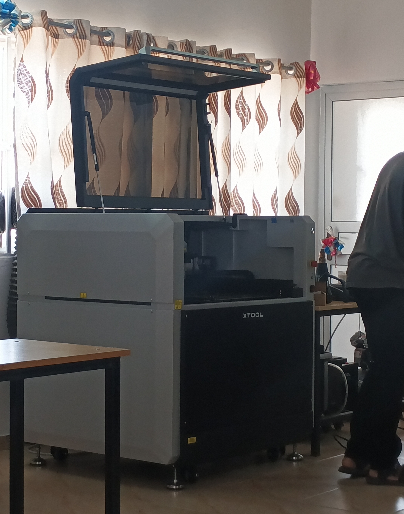

# Journal du 26 Août 2026

## SEANCE DE VISITE DES ATELIERS PRATIQUE
### VISITE 1 : DECOUPE LASER
Le formateur dans ce module a developpé 3 partie
**1- les fondamentaux de la technologie laser**
Dans cette partie on a parle du principe physique, les familles de laser, precision et securite.

**2- La marque xTool:**               Il sagit ici de lorigine, chiffres clés, positionnement et stucture de la gamme de produit.

**3- etude de 4 machines phare:**
C 'est machines sont les suivantes:
- Metalfab 

foctionne avec le laser fibre industriel ;il decoupe et utiliser dans la soudure des metaux epais.

- p3 

fonctionne avec le laser CO2 et coupe tout ce qui est bois et acrylique grand format 
- M1 Ultra

foctionne avec le laser diode et fait du craft, petites séries, pédagogie
image est
- F2 ultra

foctionne avec la fibre MOPA + diode est utilisé pour couper le metal, utiliser dans la bijouterie et le marquage.

Après on n'a eu à instaler et utiliserlapplication xtool pour la demonstration

### VISITE 2: LES BASES DE LECTRONIQUE DANS LES FABLABS
**Rappel des conceptes de bases de lectronique :**
la tension , le courant, et la resistance
on na parler  aussi du foctonnement du multimètre et du condensenteur.
**Quelques travaux pratiques**
- Mésure de la tension de deux piles misent a notre disposition
- Mésure des resistances et verification des valeurs avec le code de couleur
- Explication du foctionnement du bread board (plaquette SK10)

### VISITE 3 : FABRICATION ADDITIVE DES PRINCIPES GENERAUX A LIMPRESSION 3D FDM
géneralité sur l'imprimante 3D et presentation de quelques imprimante 3D 

**session 1:** comprendre la fabrication additive

**session 2:** maitriser la technologie FDM / FFF

### VISITE 4 : CHALLENGE SUR LES PROJETS
On a eu à discuter et proposer des projets qui resolvent des problenes educatifs comportant un peripherique d'entrée, un peripherique de sortie  et un micro contrôleur

**FIN DES ATELIERS DE GROUPE**

## CE QUE JAI  APPRIS
- les types de machines laser et leurs foctionnalité
- L'utilisation clair de la plaquette SK10
- la fonctionnalitée des machines 3D