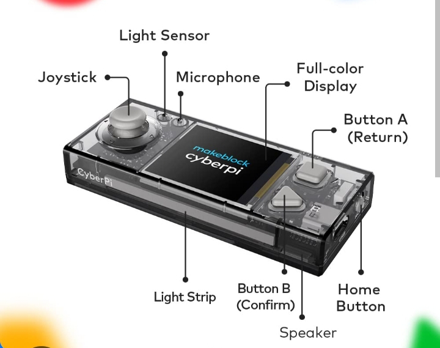
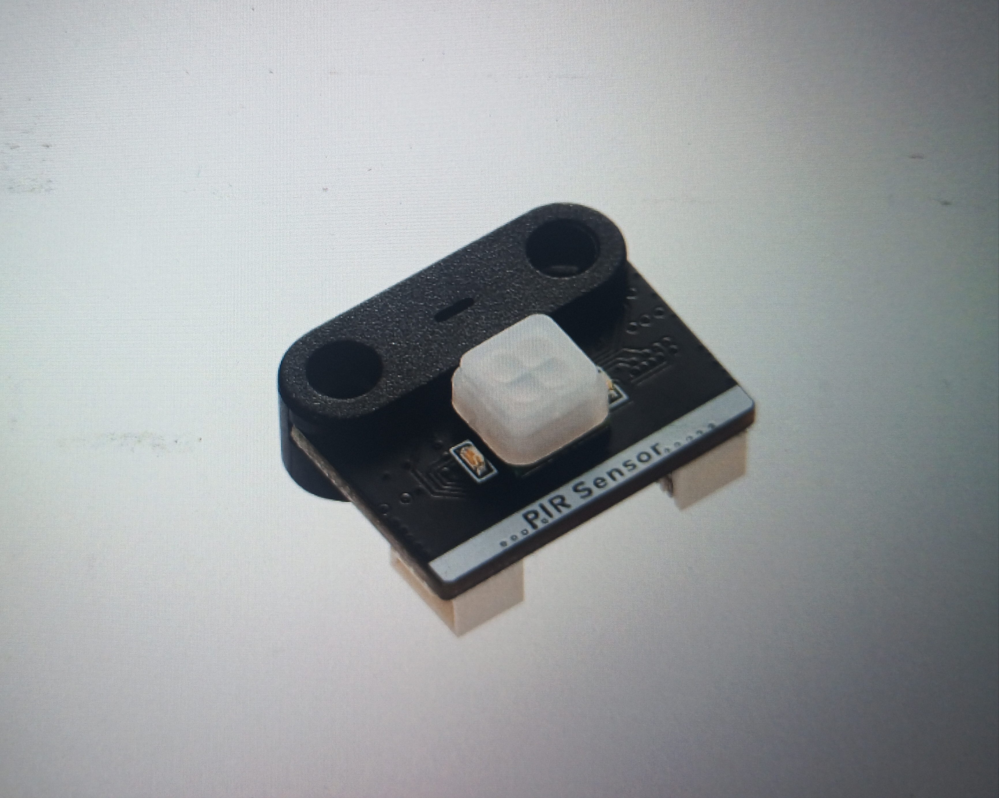
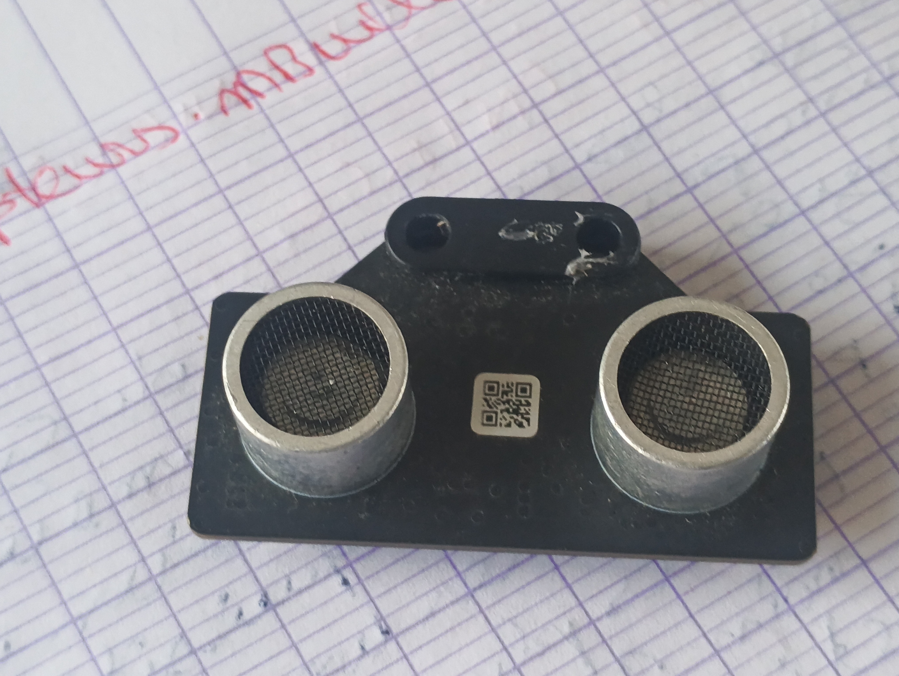
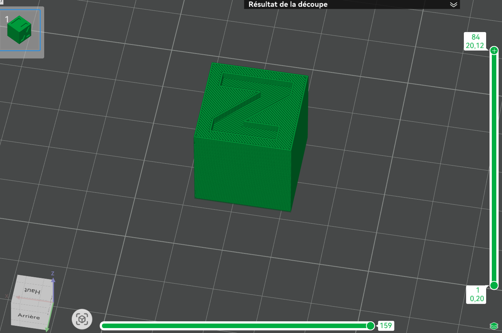

# Journal du 27 Août 2026

## ATELIER D'ELECTRONIQUE
### THEME : sortie et entrée 
**OBJECTIFS : Identifier les composants du cybrpi et les principaux modules mBuild et distinguer un capteur d'un actionnaire dans une chaine**
- Differentes partie d'un cyberpi  
- Definition de conceptes
un capteur mesure une grqndeur physique de l'environnement et la transforme en information numerique; et un actionneur reçoit une commande du programme et agit sur le monde pysique. 
**Quelques capteurs mBuild :**  
- Capteur son  
- capteur de lumière 
- le PIR 
- capteur ultrason 
**Quelques actionneurs mBuild :**
- Moteur driver
- servo driver
- LED driver
- speaker

**En fin on a eu à installer l'application mBlock:** comprendre les paramètres de base ; une application: programmation connecter au cyberpi dont l'image est la suivante 

## ATELIER D'INPRESSION 3D
### THEME : Du modele 3D au Gcode : le rôle du slicer
Le formateur a expliqué brièvement les paramètre clés et le foctionnement de limprimante 3D .
Installation et initiation au Bambu studio(l'application de manipulation et d'impression).  L'image du travail effectué  et l'image du produit final 

## ATELIER DE DECOUPE LASER
### THEME : Faire une carte de visite
Explication des paramètres de l'application xTool studio et exercice pratique faire une carte de visite en notre nom decouper à la machine laser P3 l'image du travail effectué est  

**Fin d'atélier**

## CE QUE J'AI APPRIS 
J'ai connu aujourd'hui le cyberpi et sa fonctionnalité et certains capteurs et actionneurs. j'ai connu et manupuler les application mBlock et Bambu studio. 
 ## CE QUE JE N'EST PAS PU FAIRE
 je n'ai pas réçu un projet de programmation du mBlock avec le cyberpi

 ## LA RAISON
 Les fonctionnalités de l'application ne me sont pas familiaires.
 je dois donc m'exercer plus.

 **Fin du journal du 27 Août**