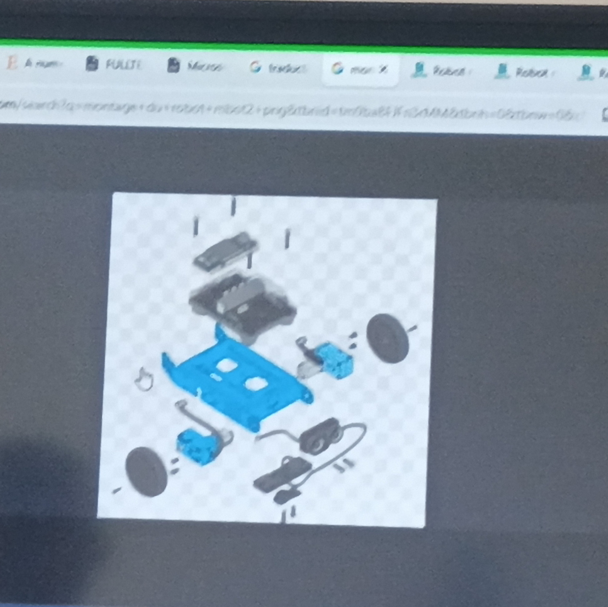
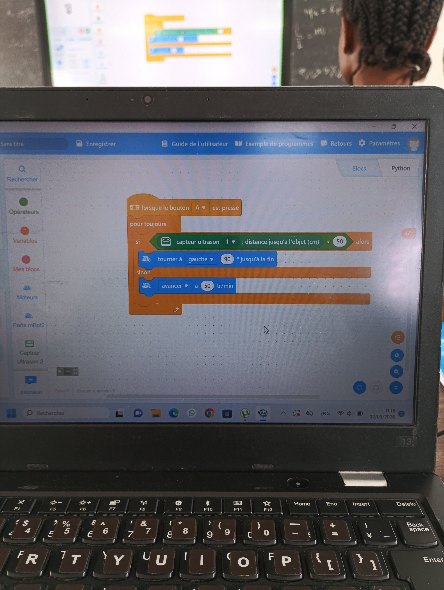
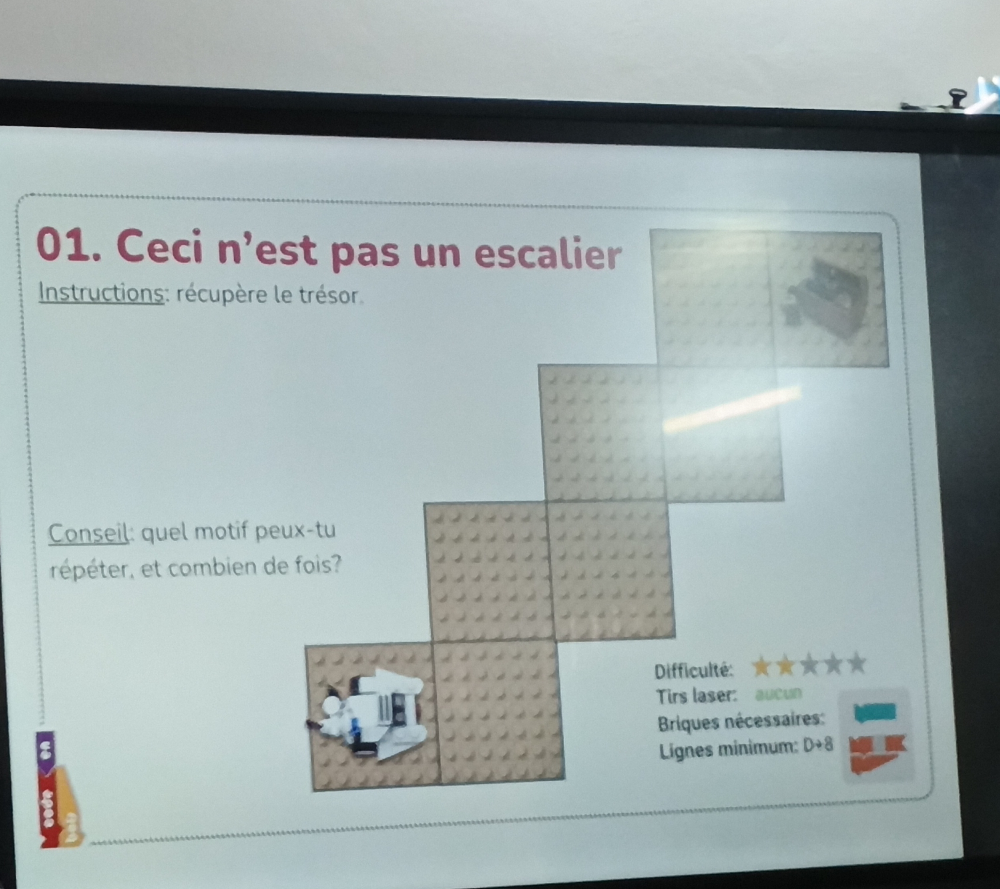
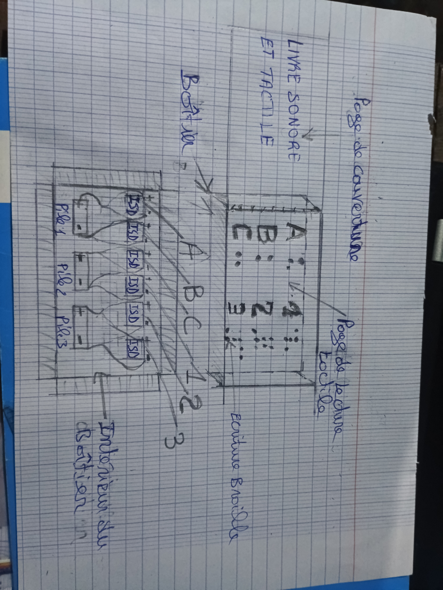

# Journal du 02 septembre 2026
Aujourdhuit nous avont suivi des cours dans les ateliers.

## Atélier d' électronique 

**Montage robot**

> Objectif: suivrev une video et monté le robot Voitire q'on féra programmer par programation.
- Matériel mis à notre disposition est consigné dans l'image suivante 

- Robot monte
 
- le programme écrit pour le faire avancer et esquiver les obstacles
  
- Robot programmer et fonctonnant
 
- Enfin démontage du robot

## Atélier laser
Nous avont suivi un cours sur **les fondamentaux des futurs fabmanager** plus précisement ce que s'est qu'un **Algorithme**
> Un algorithme est une suite logique finie et ordonnée d'instruction pour résoudre un problème.
> Un algorithme débranché est un algorithme qui ne respecte pas trois règles à savoir:
- une suite ordonnée d'instruction
- un nombre fini d'étapes 
- des instruction prrécises qui résolvent un problème donné .
> Exercice pratique suivre ces etapes de placement d'un robot jusqu'au lieu du trésor . L' image de l'exercice est la suivante :

> exercice traite par mon groupe
[effectue](../medias/Effectue.png)

## Troisièeme parti  travaille de groupe pour les progets
Déssin vissible de notre projet :

 **fin du journal**