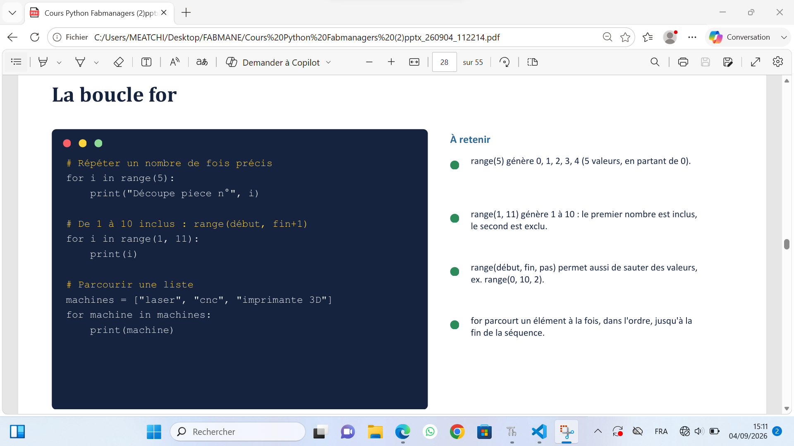
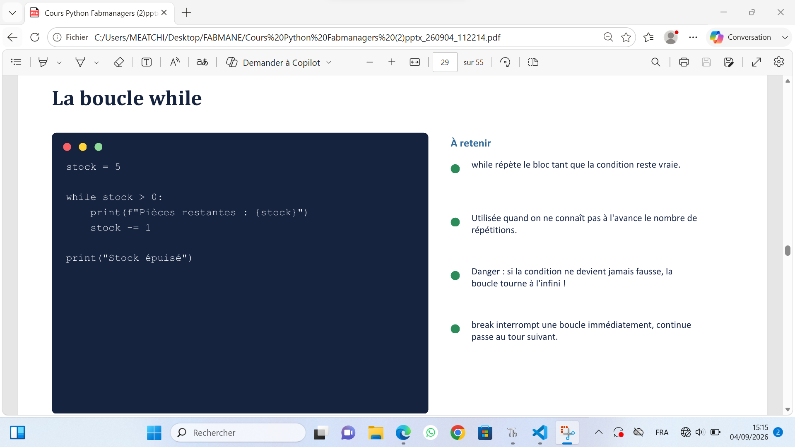
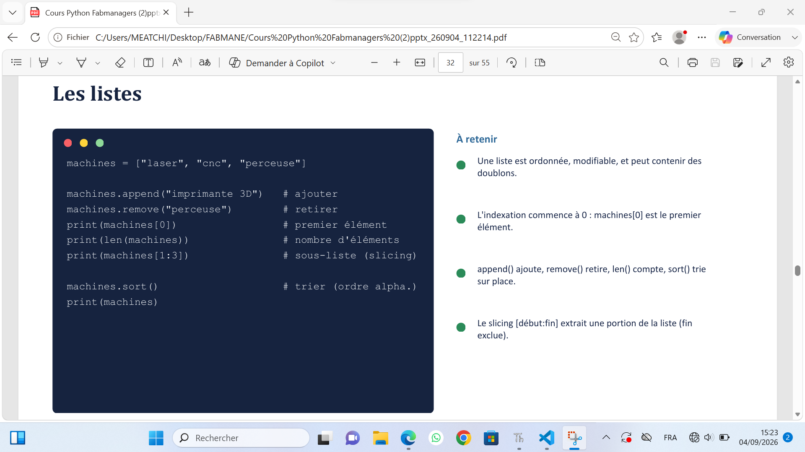
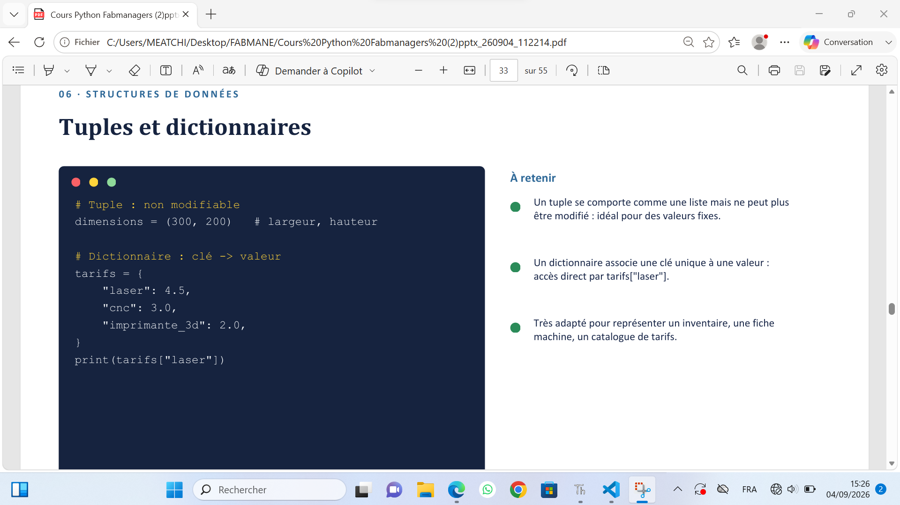
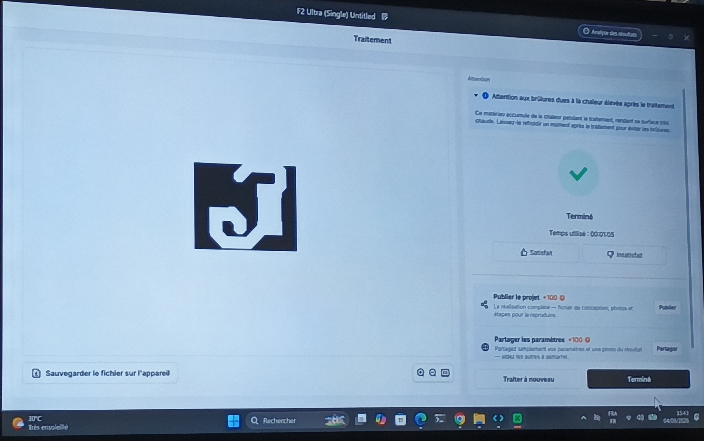
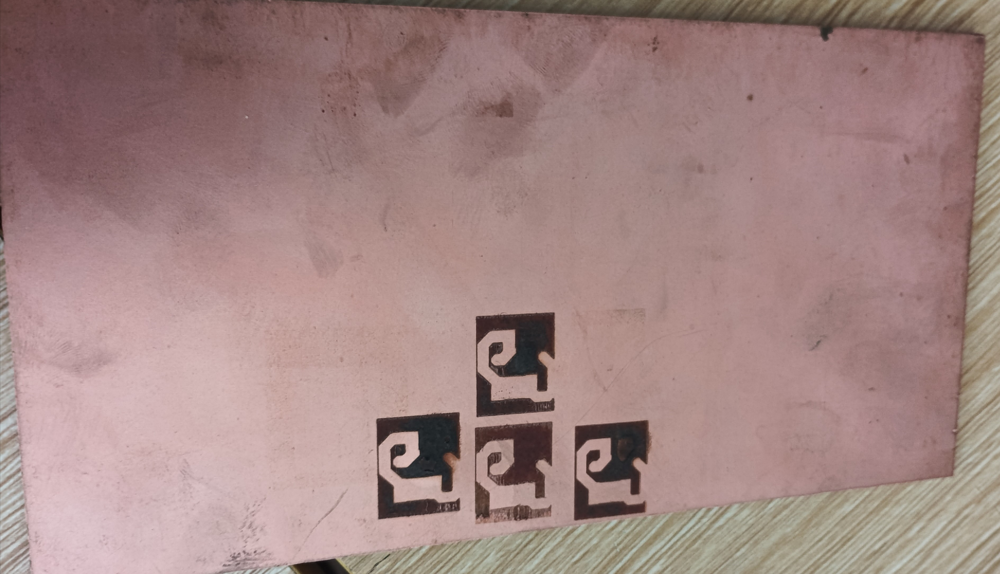
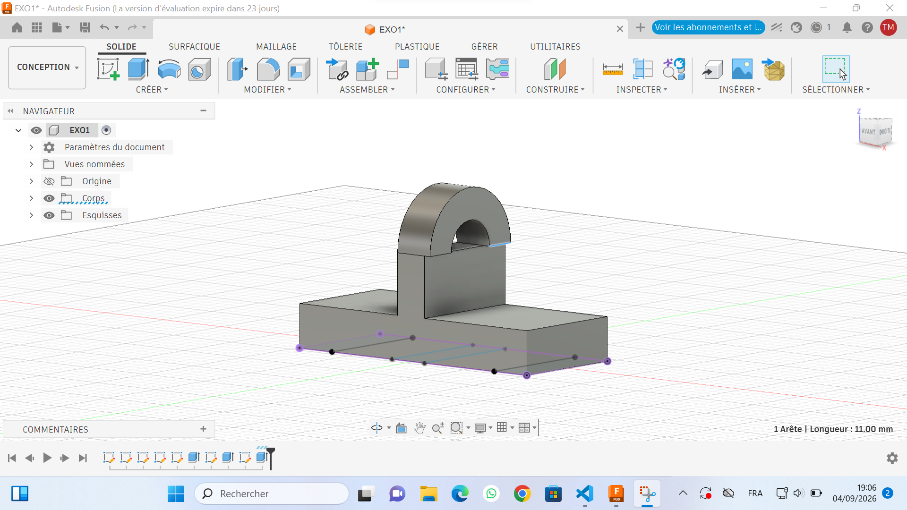

# Journal du 04 septembre 2026 écrit par MEATCHI Tabalo Joel
Aujourd'hui nous avons eu à faire :

## Module 1: Python fabmanager (suite)
le cours à débuter par un exercice pratique qui cosiste à manupuler les variables, types et f-strings pour générer une fiche technique.Ensuite nous avons vu:

 ### Les structures de contrôle
 - les opérateurs indispensables (Arithmétiques, comparaison)
 - Les conditions : if; elif;else 
 leur utilisation est consigné dans l'image suivante  . Suivi d'un exercice qui a pour objectif d'écrire un script qui autorise ou refuse l'usage d'une machine par un élève sélon son niveau.
 
 ### Les boucles
 - La boucle for : son usage est consigné dans l'image suivante 
 - La boucle while son foctionnément est comme suit  et un exercice pratiaue.
 
### Structures de données
- Les listes : 

- Tuples et dictionnaire

## Module 2 : cours sur la fabrication des PCB
On a vu dans cet module
- pourquoi fabriquer un PCB
- De quoi est constitué un PCB
- Les principales méthodes de fabrication
- Du schéma électronique au  PCB
- Utilisation de Xtool pour imprimer les PCB : On utilise par défaut et par expérience le F2 ultra. procédure clair pour imprimer. Voici les images:

résultat de l'impression .

## module 3 : Exercice sur fuision 360
 l'exercice qu'on nous a soumis est le suivant 

## ce j'ai fais 
- j'ai acquis une fois de plus des connaissance sur la programmation python ;
- j' ai appris theoriquement  comment foctionne un PCB et comment on l'obtient,
- je me suis exercé sur fuision 360.

## ce qui n'a pas marché
- je nai pas fini mon exercice de fuision 360. voici ce que j'ai pu faire

- je doit donc m'execer plus et trouver la meilleur façon de vite modéliser les déssin qui me sont soumis.