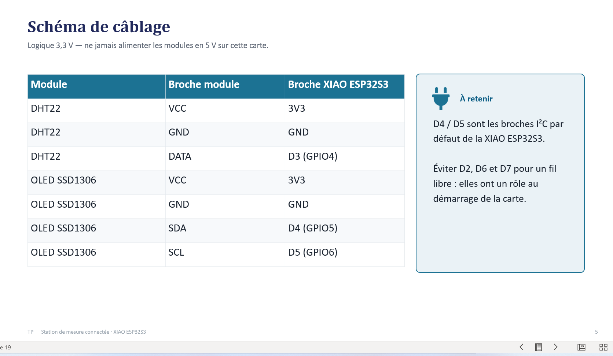
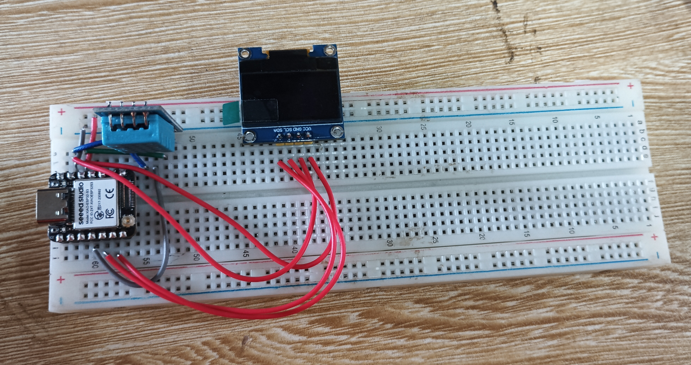
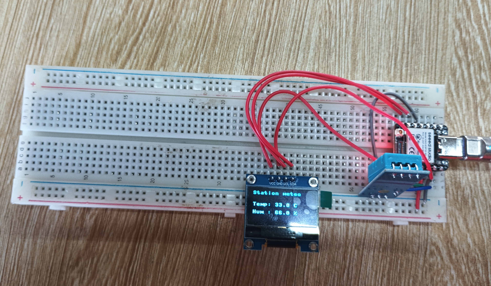

# Journal du 05 septembre 2026 rédigé par MEATCHI Tabalo Joel

## Extention Smart Weather station
**Objectifs de la séance**
- Installer et confugurer L'IDE Thonny pour programmer une carte ESP32S3 en microPython
- Flasher le firmware MicroPython sur un XIAO ESP32S3
- Câbler correctement un capteur DHT22 et un écran OLED SSD 1306 en I2C
- Installer une bibliothèque externe microPython via le gestionnaire de paquets de Thonny
- Lire une mésure de température et d'humidité et l'afficher au temps réel sur l'écran OLED

## Matériels mis à notre disposition :
- XIAO ESP32S3
- Capteur DHT22
- Ecran OLED 
- Câble USB-C
- Breadboard
- Fils de câblage mâle-mâle
- Ordinateur avec thonny installer

>Les differentes parties des matériels de câblage furent  donnés et expliqués.
Voici le schéma du cablage :

Voici le résultat de mon équipe:

Voici le résultat final du travail:

## Ce que j'ai appris
j'ais appris à faire le câblage sur la plaquette électronique SK10 en me servant d'un schéma de câblage, et comment la programmation intervient dans se procesus.

## Ce qui n'a pas marché
- nous avont pas pu afficher au prémier  les mésures dû fait qu'un fil de connexion s'est détaché de la plaquette. 
- Au deuxième coup aussi parce qu'il y avais une erreur dans le programme pyton que nous avont copier.

## Solution
Ainsi nous avons dû renplacer dqns notre programme  DHT22 par DHT11  pour que le programme marche et que l'écran d'OLED nous affiche des mésures en tant réel avec l'aide des formateurs.
   **fin de mon journal**
