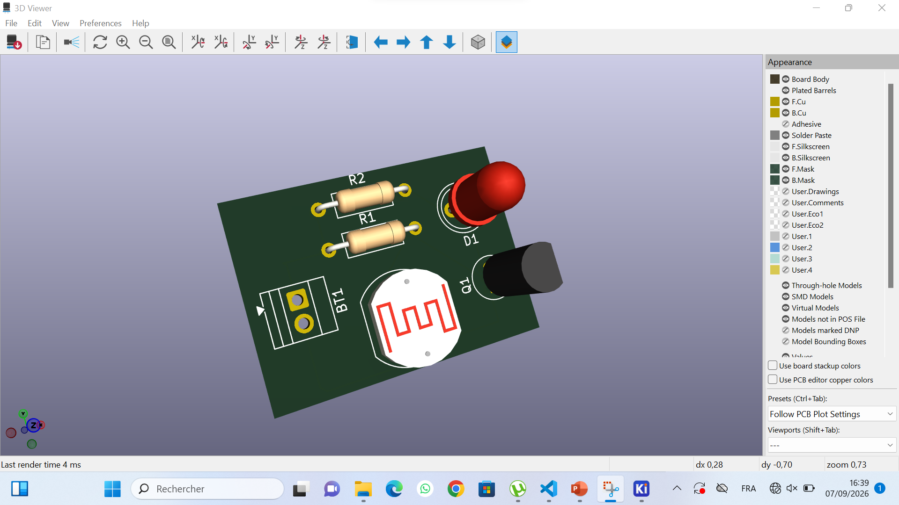

# Journal du 07 septembre 2026 rédigé par MEATCHI Tabalo Joel

## Thème: PCB ou circuit imprimé
Installation de l'application Kicad.

### C'est quoi un PCB
PCB signifie Printed Circuit Board ou circuit imprimé en français.

### Pourquoi doit on parler de PCB ?
Il permet d'avoir une connexion solide lorsqu'il aura des vibrations. Le circuit est donc gravée sur une plaquette cuivrée facilement déplaçable.
- La breadboard permet d'expérimenter alors que le PCB permet de transformer l'expérience en une carte électronique réelle.
> **La bredboard** a des caractéristiques suivantes :
- câbles volumineux et fragiles
- connexion moin fiable
- Sensible aux vibrations
- difficile à dupliquer

**le PCB** permet de corriger les défaux de la breadboard.

###  Comment passer de l'idée au schéma
- Définir clairement ce que le circuit dois faire
- Choisir les composants adaptés
- Réaliser le schéma électronique avant de déssiner la carte
- Associer chaque composant footprint
- Définir les contraintes alimentation, courant, conducteurs, environnement.

### exercice pratique réalisation d'un circuit avec un transistor : Détecteur de lumière ou d'obscurité :
- les matériaux nécessaire: une battérie, un transistor, une LED, deux résistances, un 
- voici le schéma du circuit réaliser :  
- Voici le résultat final du câblage :  

### Ce que j'ai appris
- l'importance du PCB
- Comment réaliser un PCB à l'aide de l'application Kicad

> Tout était parfait.

> **Fin de mon journal**
