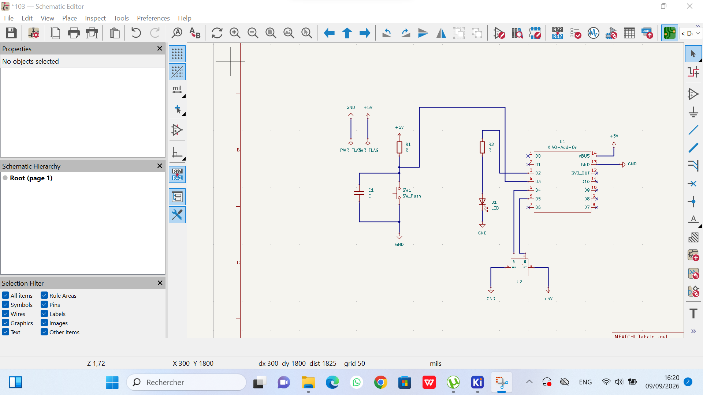
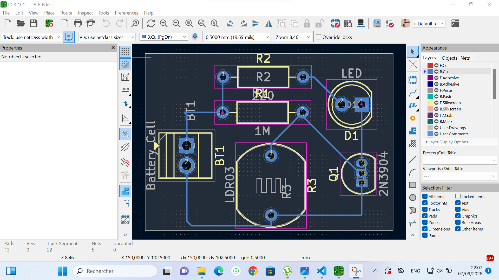
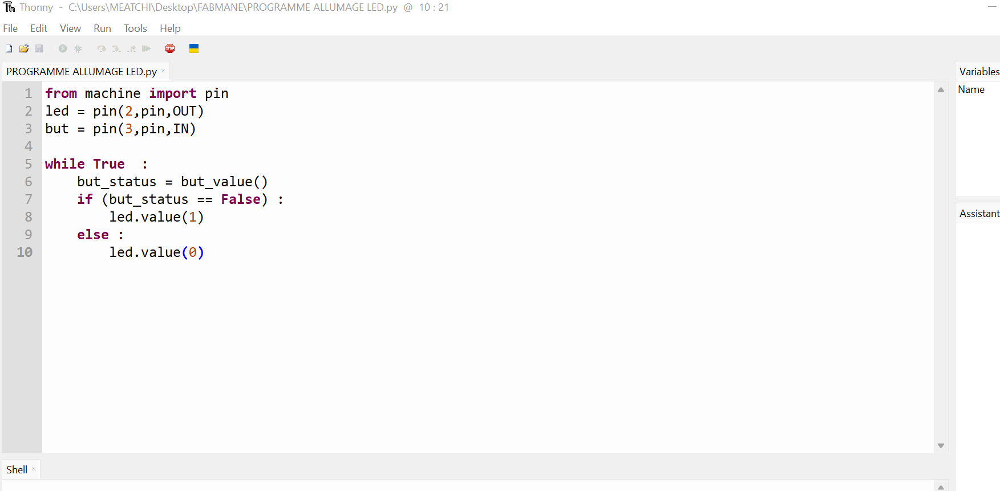

# Journal du 09 septembre 2026 (rédigé par MEATCHI Tabalo Joel)

**la séance du jour a pour but de nous montrer comment réaliser un projet du début jusqu'à la fin avec un exemple précis.**

## 1) Câblage du circuit avec Kicad
- Création du dossier de travail
- importation des élements pour réaliser notre cicuit. Le cicuit à réaliser est le suivant :
 
- réalisation du schématique en important les élements à connecter.
- Importation des librairies des élements qui ne sont pas dans kicad : la XIAO et le OLED .
- voici le shématique du circuit réalisé :
 
- Nous avont au final réaliser notre  PCB  qui est le suivant : 
 
 
 ## 1) Programmation python
 - Rappel des règles fondammentaux de la programmation en géneral ,
 - programmation de la LED à l'aide de python . Voici le début de notre programme :
 

## Mes difficultés
- En réalisant notre PCB mon PC s'est arreté et j'ai perdu le fil. par l'aide des formateurs j'ai pu faire une partie . 
- Dans mon PCB Je ne trouve pas l'OLED. Je ne sais pas pourquoi .

## solution 
Je dois donc chercher ce qui m'a échappé .

## A faire Plus tard
- Rédresser les liaisons de notre PCB;
- Complèter notre programme python;
- Terminer la réalisation de notre projet .

     **Fin du journal**

