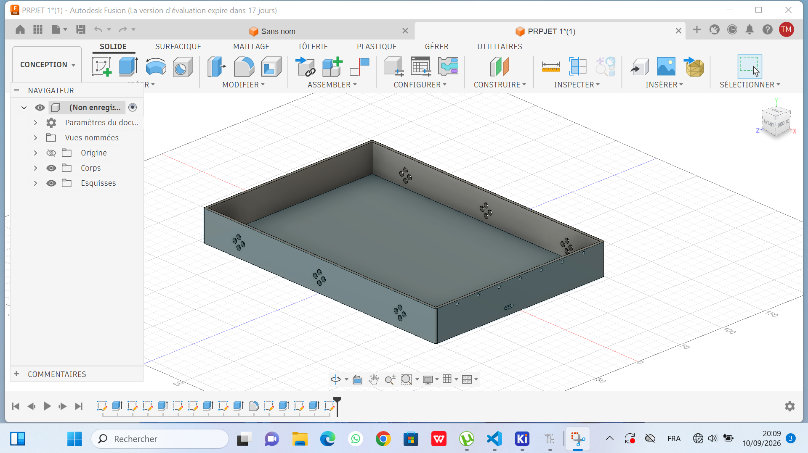
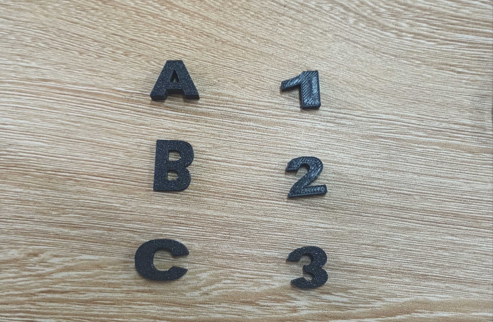

# Journal du 10 septembre 2026 (rédigé par MEATCHI Tabalo Joel)

**réalisation de projet**
> GROUPE 8  
PROJET : Livre tactile et sonore 

## Fais aujourd'hui
- Rémodélisation de notre boitier avec fusion 360
voici l'image du nouveau modèle :

- nous avons aussi modélser et imprimer nos lettres (A,B et C) et nos chiffres (1,2,3) qui se trouvérons sur la page de notre livre.
voici l'image de ceux ci :

- révu de nos matériaux d'électroniques vu que les matériaux ne sont pas encore disponibles.

## Nos erreurs
les lettres n'ont pas la meme épaisseurs ainsi que nos chiffres sont renversés

## A faire démain 
- Révoir nos lettres et chiffres 
- voir la partie électronique si les matériaux sont disponibles.
- Conévoir notre page de couverture et si possible la page de lecture.
- Imprimer en  3D notre boitier qui contiendra les élements électroniques.

 **FIn du journal**
