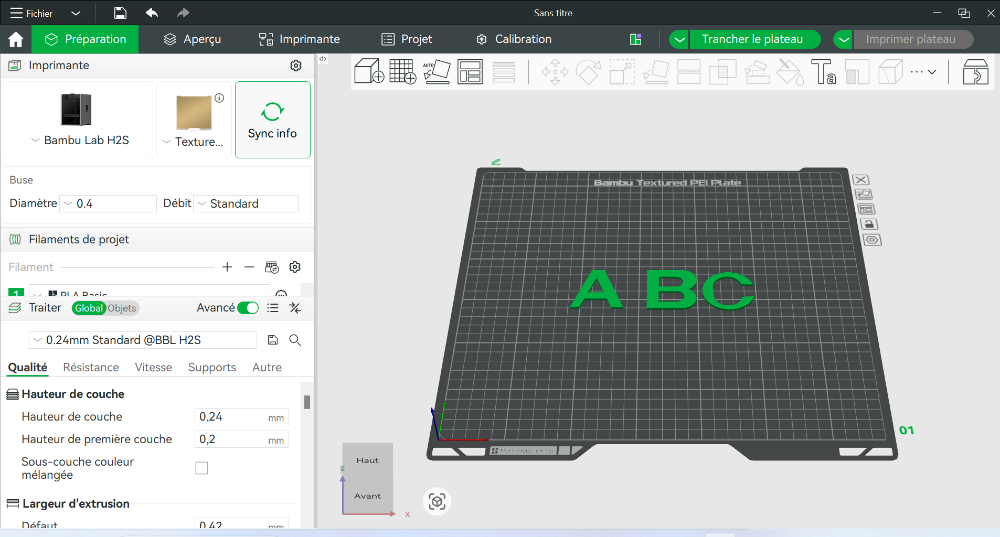

# Journal du 12 septembre 2026 (Rédigé par MEATCHI Tabalo Joel)
 
 **Travail de groupe sur le projet**
 >Groupe 8 :  projet **livre tactile et sonore**.
## Fait aujourd'hui 

- Modèlisation en 3D des lettres A,B et C de notre page avec Fusion 360 .
Voici l'image de celles ci :

- Révu des élements qui restérons sur notre page comme la place des bouttons qui sérons rélier à nos ISD , et aussi la place de notre intérrupteur sur le boitier.
## Avancé 
Nous avons eu une vue d'emsemble de notre boitier et de notre page .

## Difficultés
On a que emit les idées pas de conception  puisque les matérils ne sont pas encore disponible . La modélisation des lettres nous a pris assez de temps et de plus après avoir trancher nous avons pas pus imprimer du fait que plusieurs groupes ont lancer leurs impression 3D.

**Fin du journal**

