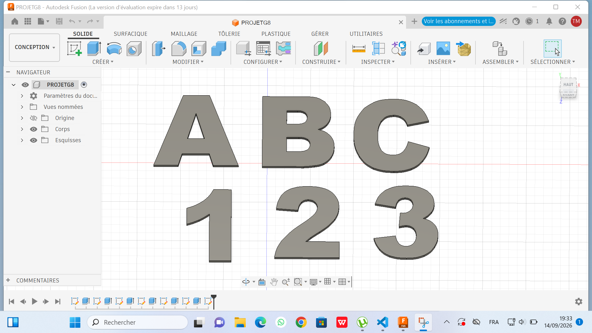

# Journal du 14 Septembre 2026 (Rédigé par MEATCHI Tabalo Joel)

**Travail sur le projet**

Groupe 8: livre digital et sonore .

## Fait aujourd'hui 

- Révu de notre page de lecture :

- révu du modèle de nos lettres et chiffres dans fusion 360 :

- Discution afin de trouver une alternative vu que nos matériels tardent à vénir;
- Il nous ai sugéré d'utiliser une autre approche pour arriver aux mème résultat vu que nos matériels tardent à vénir . Idée émise par le formateur Wisdom.

### Nouveaux matériels à considérer pour la nouvelle approche
- le ESP 32
- Le max 98357A
- Haut parleur 8 Ohm

## Avancées
Nous avons ecrit un code micro python pour programmer la voix que nous associérons à notre ESP32 .

## Difficultés

 Nous étions limité du faite que les ISD n'était pas à notre disposition.

 **FIN DU JOURNAL**
