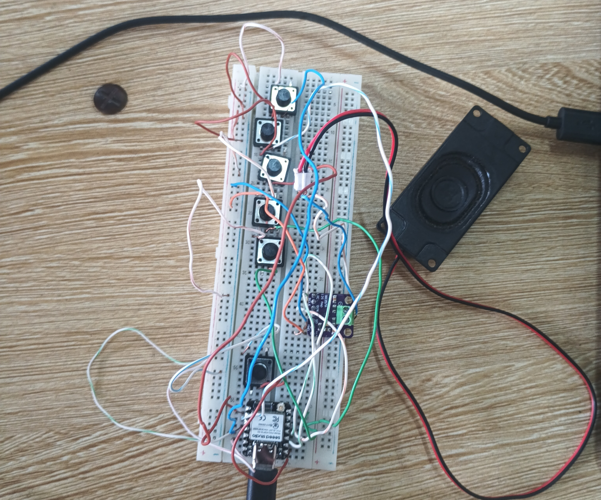
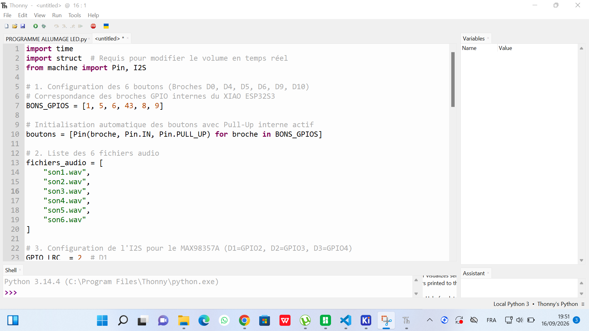
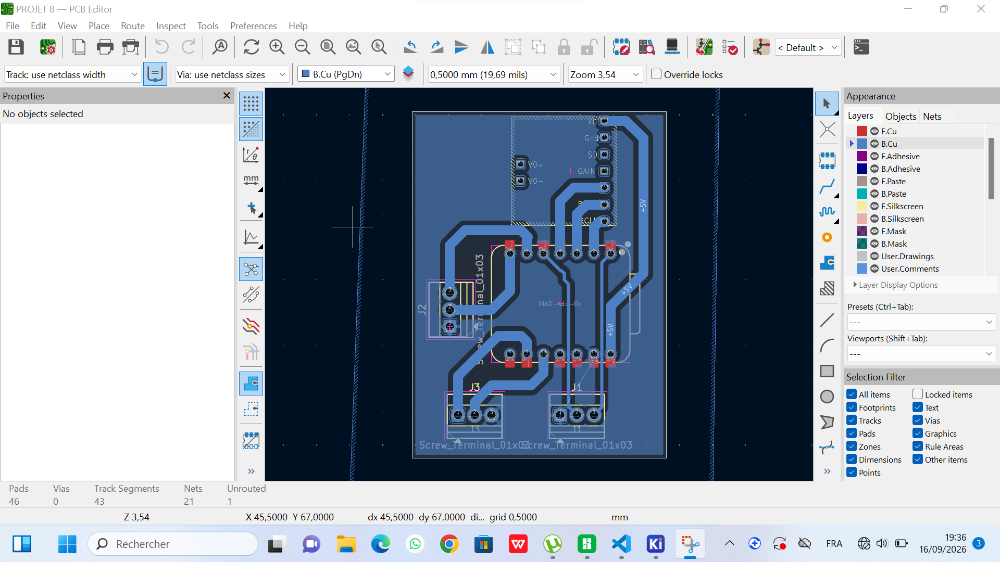
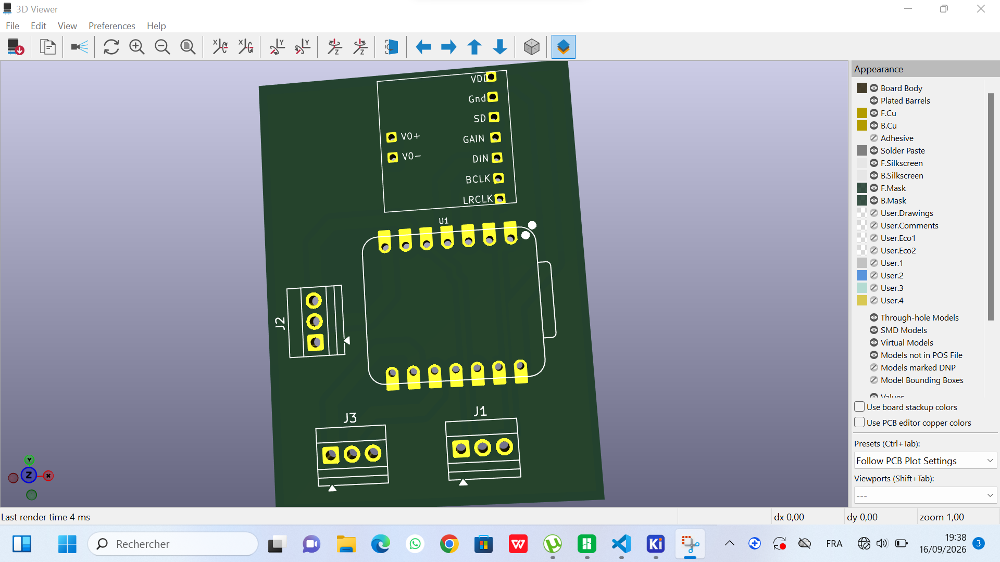

# Journal du 16 Septembre 2026 (Rédigé par MEATCHI Tabalo Joel)

**travail sur le projet**

> Groupe 8 : Livre digital et sonore

## Fait aujourd'hui
- Câblage des composants suivants sur le SK10:l'ESP 32s3, le max 98357A, 6 boutons poussoirs, un haut parleur. Voici l'image du câblage réussi :

- On a écrit un code qui nous a sorti des audios enrégistrer sur l'ESP 32 s3 .
Voici une partie de notre code micropython :

- fabrication du PCB correspondant à notre câblage . voici l'image du résultat :

## Avancés
Nous avont pu faire notre PCB.

## Difficultés
La fabrication du PCB sur Kicad nous a pris assez du temps .

## A faire demain 
- Imprimer notre PCB,
- Révoir  notre boitier et page ;
- finaliser avec le livre;
- Faire notre powerpoint de présentation .

**Fin du journal**
