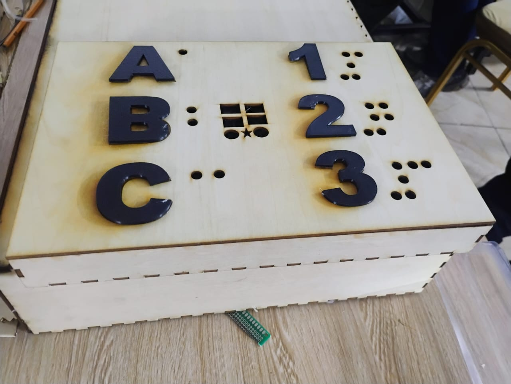

# Journal du 17 septembre 2026 (Rédigé par MEATCHI Tabalo Joel)
**travail sur le projet**
> groupe 8 : Livre digital et sonore .

## Fais aujourd'hui
- Prémiérement nous avont comme prévu imprimé le PCB;
- La soudure du PCB n'as pas été comme prévu donc on l'a laissé tombé et câbler directement sur le SK10
- Nous avons tout remonter sur le SK10 .

## Avancés
Nous avons conçu notre livre digital et sonore dont l'image est le suivant :
.

## Dfficultés
- le routage du PCB sur Kicad à été mal fait d'ou le mauvais PCB imprimer,
- nous avont pris assez de temps pour chercher à réssoudre se problème ,
- nous avont ini notre projet au tour de 22h .

## Ce que j'ai appris aujourd'hui
- La soudure avec l'étain,
- résoudre des brobléme de connection de fils parmis tant d'autres, 
- A continuer malgrer la défaite .

**Fin du journal**
