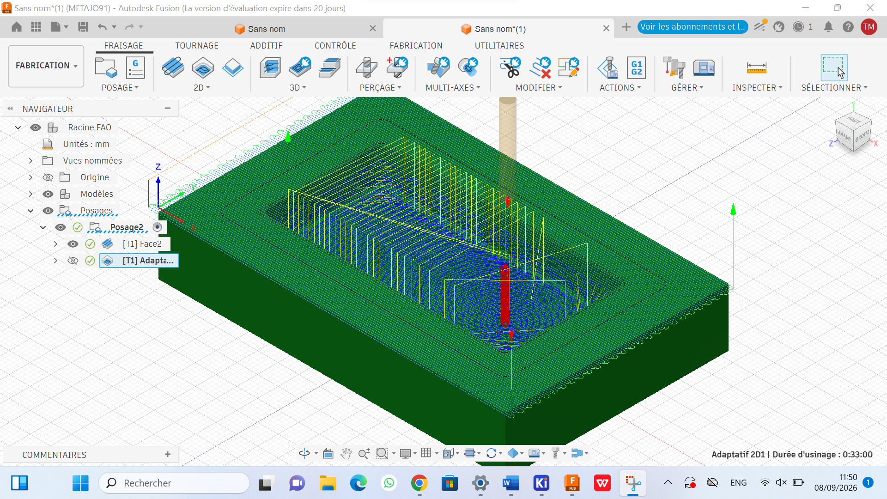
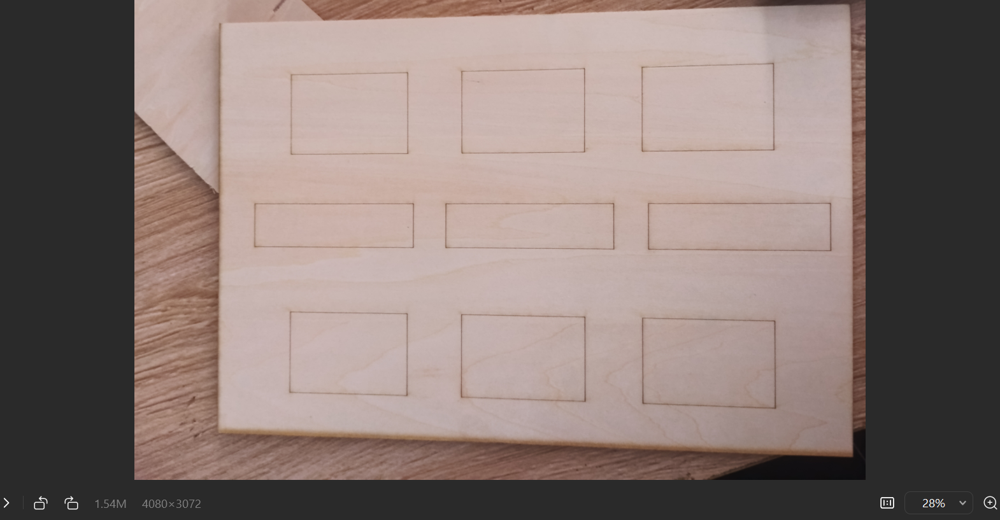
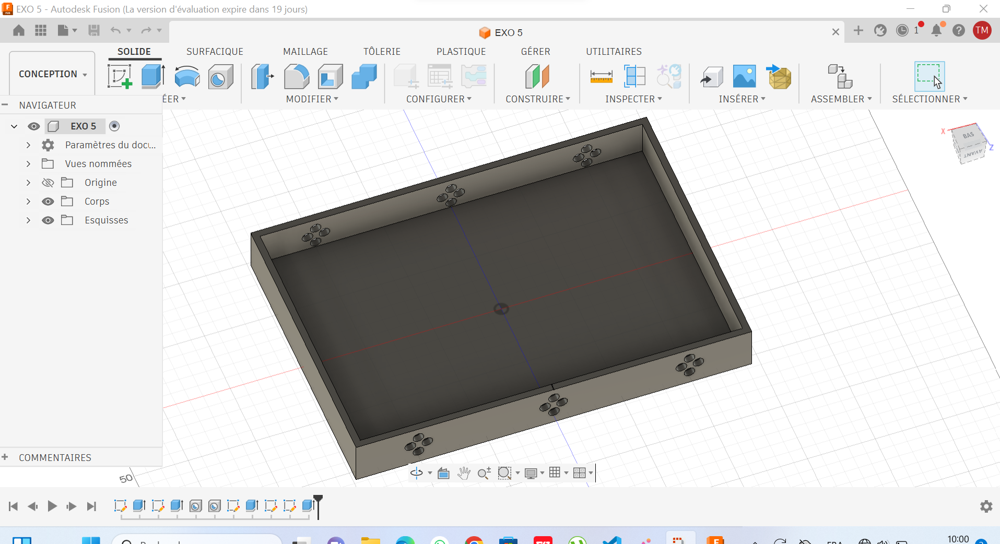

# Journal du O8 septembre 2026 (rédigé par MEATCHI Tabalo Joel)

## Thème du jour : FAO ( Fabrication assistée par Ordinateur) sur fusion 360
**De la conception à la pièce usinée**

### Ce que j'ai appris du cours
On a deux FAO :
- La FAO additive ;
- La FAO soustractive
Nous nous inrèresseront à la **FAO soustractive**

- La machine utilisée :la CNC qui signifie : Commande Numérique par Calculateur.
Image de la machine  

 - prémièrement nous dévons concévoir notre objet en 3D dans Fusion 360.
La conception est la suivante :  .

- En suite faire le règlage de l'outil à utiliser :  
- exporter la conception et l'envoyer dans candle.

fin de du module de la matinée.
 ## la soirée: Travail du groupe sur notre projet 
 ### Groupe 8 ; Projet: livre tactile et sonore 
  
  Nous avont dimensionner notre boitier dans lequel nous aurons nos matériaux electroniques
  et la plaquette sur laquelle nous possérons nos ISD; et nos piles. voici les images du travail éffectué ; 
  
  **Fin du journal.**

